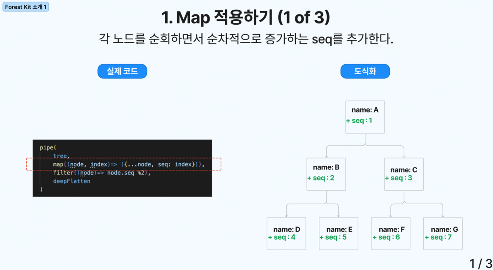

# (알파 버전) Forest Kit JS에 오신걸 환영합니다

## 개요

### 트리구조 조작을 위한 모음 도구

- 트리 데이터 구조의 복잡한 세계를 탐험하는 개발자를 위해 설계된 궁극의 라이브러리입니다.
- Forest Kit을 통해, 어떤 트리 모양의 데이터라도 애플리케이션의 필요에 맞게 쉽게 조작, 변환 및 관리할 수 있습니다.
- 계층적 데이터 모델, 중첩된 객체, 또는 복잡한 데이터 트리를 다루고 있든, Forest Kit은 코드상 간결하면서 높은 수준의 함수형 프로그래밍 방식을 통해서 최적의 해결책을 제공합니다.
- 더이상 Stack Overflow에서 트리 자료구조 처리에 대한 코드를 복사 및 붙여넣기 할 필요가 없습니다. Forest Kit이 모든 것을 해결해 드립니다.

### 폴더 구조
- src/operator
  - Tree를 조작, 변환, 관리할 수 있는 함수 단위 기능의 모음    
- src/test
  - operator 내 모든 기능에 대한 테스트 코드가 작성됨. 
- src/_internal
  - operator를 작성 시 필요한 helper 함수 모음
- src/pipe
  - operator를 합성하기 위한 pipe 와 compose 함수가 존재

### 주요 의존성 라이브러리
 - ramdaJS : 자바스크립트에서 함수형 프로그래밍을 지원하기 위한 유틸리티 라이브러리
 - jest : TDD 및 커버리지 리포트 측정을 위한 테스트 라이브러리

### operator 함수 중 하나인, `extractLeafNode` 코드
  - 트리 내 모든 단말 노드를 추출해서 노드 타입 배열을 반환합니다.
```typescript
  import { isLeafNode } from "./isLeafNode";
  import { deepFlatten } from "./deepFlatten";
  
  import { type TOperatorSettings } from "../_internal/type";
  
  const R = require("ramda");
  
  export const extractLeafNodes = R.curry(
    <TNode>(ops: TOperatorSettings, nodes: TNode[]): TNode[] =>
      R.pipe(deepFlatten(ops), R.filter(isLeafNode(ops)))(nodes),
  );
```

### 커버리지 리포트
 - 최대한 많은 엣지 테스트 케이스를 작성하려고 노력했습니다.


### Forest-kit 코드 사용 예시



- 불변성 보장: 각 함수의 결과는 깊은 복사로, 원본 트리에 영향을 미치지 않습니다.
- 순수함수 기반
- 함수 합성 및 다형성 만족

### 간략한 함수 소개 


## 전체 함수 소개 (TODO: 함수 인터페이스에 대한 문서 작성)

### Insert Node Operator

- insertFromParentBy
  - 객체 및 배열을 parentNode에 삽입
  - ParentNode의 자식 중 first, last, 특정 index 지정 가능
- insertBesideSiblingBy
  - 객체 및 배열을 특정 형제 노드의 left 또는 right에 삽입
- insertAtPosition
  - 특정 위치값 (예시: "1.1.2")에 객체 및 배열을 삽입

### map Node Operator

- map
  - 모든 노드에 대해서 transformation을 적용합니다.
- mapBy
  - 최소 map 적용 갯수 및 최대 map 적용 갯수를 지정할 수 있습니다.
- mapOneBy
  - 특정 조건을 만족하는 단일 노드만 transforamtion을 적용합니다.
- mapManyBy
  - 특정 조건을 만족하는 여러 노드에 대해서만 transformation을 적용합니다.

### Filtering Node Operator

- filter
  - 모든 노드에 대해서 filtering을 적용합니다.
- filterBy
  - 최소 filter 적용 갯수 및 최대 filter 적용 갯수를 지정할 수 있습니다.
- findOneBy
  - 특정 조건을 만족하는 단일 노드만 filtering 합니다.
- filterManyBy
  - 특정 조건을 만족하는 여러 노드에 대해서만 filtering 합니다.

### Find Node Operator  

- find
  - 모든 노드에 대해서 find를 적용합니다.
- findNodeBy
  - 최소 find 적용 갯수 및 최대 find 적용 갯수를 지정할 수 있습니다.
- findOneBy
  - 특정 조건을 만족하는 단일 노드만 반환합니다.
- findManyBy
  - 특정 조건을 만족하는 여러 노드를 반환합니다.

### Tap Node Operator

- tap
  - 모든 노드에 대해서 tap을 적용합니다.
- tapBy
  - 최소 tap 적용 갯수 및 최대 tap 적용 갯수를 지정할 수 있습니다.
- tapOneBy
  - 특정 조건을 만족하는 단일 노드만 tap 합니다.
- tapManyBy
  - 특정 조건을 만족하는 여러 노드에 대해서만 tap 합니다.

### Merging Tree Operator

- mergeTreesBy
  - 두 트리를, 오른쪽 트리 노드를 우선하여서 왼쪽 트리의 매핑되는 노드와 병합니다. 
- (예정) mergeLeft
- (예정) mergeRight
- (예정) mergeDeepLeft
- (예정) mergeDeepRight
- (예정) mergeDeepWith
- (예정) mergeDeepWithKey

### Traveling Node Operator

- travserWithApply
  - 전위, 중위, 후위 순회를 지원합니다.
  - 방문 시, 적용할 함수를 지정할 수 있습니다.

### Extension Utility

- deepFlatten
  - 트리 구조를 1차원 배열로 변환합니다.
- extractLeafNodes
  - 트리 구조에서 리프 노드만 추출합니다.
- extractNDepthNodes
  - 트리 구조에서 N 레벨 노드만 추출합니다.
- someOnLeafNodes
  - 리프 노드 중 하나라도 조건을 만족하는지 확인합니다.
- everyOnLeafNodes
  - 리프 노드 모두가 조건을 만족하는지 확인합니다.
- some
  - 트리 구조 중 하나라도 조건을 만족하는지 확인합니다.
- every
  - 트리 구조 모두가 조건을 만족하는지 확인합니다.
- removePropToEachNode
  - 트리 구조의 모든 노드에서 특정 프로퍼티를 제거합니다.
  - (예정) 1개 노드만 적용 또는 여러 노드에 적용할 수 있는 Option 추가
- changePropNameToEachNode
  - 트리 구조의 모든 노드에서 특정 프로퍼티 이름을 변경합니다.
  - (예정) 1개 노드만 적용 또는 여러 노드에 적용할 수 있는 Option 추가
- addIncrementalNumberToEachNode
  - 트리 구조의 모든 노드에 순차적인 번호를 추가합니다.
- addPositionToEachNode
  - 트리 구조의 모든 노드에 위치값을 추가합니다.
- (예정) hasPosition
  - 트리 구조 내 특정 위치값의 노드가 있는지 확인합니다.

### Node Utility

- hasChildren
  - 특정 노드가 자식 노드를 가지고 있는지 확인합니다.
- isLeafNode
  - 특정 노드가 리프 노드인지 확인합니다.
- verifyNodeAllPropsTypeMatch
  - 특정 노드의 모든 프로퍼티 타입이 일치하는지 확인합니다.
- verifyNodesAllPropsTypeMatch
  - 트리 구조 내 모든 노드의 모든 프로퍼티 타입이 일치하는지 확인합니다.
- (예정) 어떤 노드가 Struct와 일치하지 않는지 반환하는 별도 함수 필요

### etc Utility

- ensureArray
  - 배열이 아닌 경우, 배열로 변환합니다.

### Error Handling Operator

- 추후 지원 예정, 현재는 JS 문법상 지원하는 try-catch 구문을 활용하여 주세요.

## 마일스톤

1. 기존 테스트 케이스 개선 및 코너 테스트 케이스 추가
2. 함수 별 Option 추가 
3. 미지원 함수 추가
4. 문서화 작업 (예시: 함수 인터페이스에 대한 문서 작성)
5. 정식 버전으로 승격
6. NPM 배포

## 읽어주셔서 감사합니다. 피드백 및 기여해주실 분들을 찾고 있습니다.
